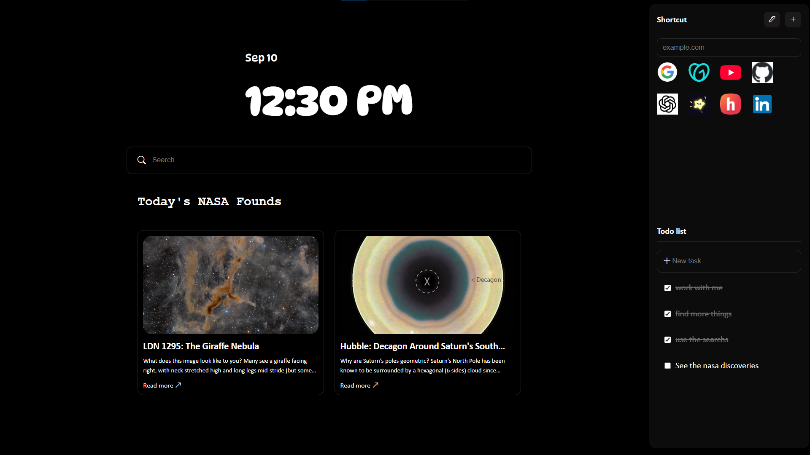
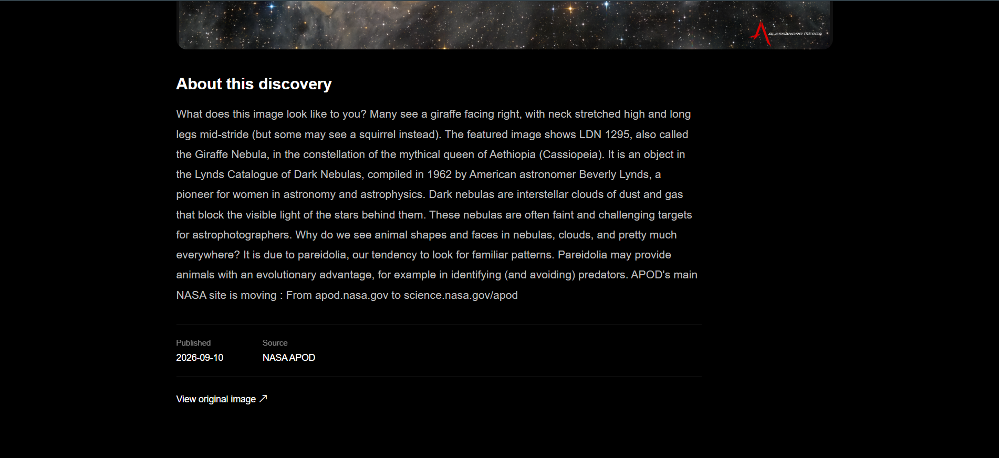

# Orank Tab


Orank Tab is a clean and practical Chrome new tab page made with React.

It has a big clock, a search bar, useful shortcuts, a todo list, and the latest astronomy discoveries from NASA. I wanted to make something simple that looks good and is actually useful every day.

## Features

- Big clock and date
- Google search with autocomplete
- Custom shortcuts
- Todo list saved in local storage
- NASA Astronomy Picture of the Day
- NASA discovery page with more details
- Simple achievements system
- Dark and minimal UI
- Responsive layout

## Screenshots

### Home Page



### NASA Discoveries



## Built With

- React
- TypeScript
- CSS
- NASA API

## Run Locally

Clone the project and install the dependencies:

```bash
npm install
